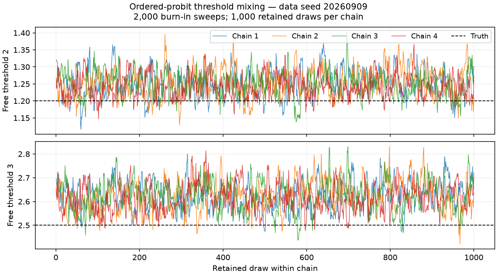

# Ordered-probit validation

Completed base datasets: **2/10**. Coverage validation is incomplete until all ten prescribed seeds finish.

The implementation retains ordered probit. This experiment tests LongBet's ordered-probit sampler; it is not a comparison with cloglog. The separate prototype and weighted-treatment-tree gates in `ordinal.md` section 10 would be required before replacing this backend. No cloglog option is exposed.

## Reproduction

```sh
.venv/bin/python benchmarks/ordinal_validation.py --data-seed 20260909
# Inspect that dataset, then repeat for 20260910 through 20260918.
.venv/bin/python benchmarks/ordinal_validation.py --data-seed 20260909 --random-intercept
.venv/bin/python benchmarks/report_ordinal_validation.py
.venv/bin/python -m pytest tests/test_ordinal_validation.py -m slow -q
```

Each case directory contains `settings.json`, `dgp.npz`, `posterior.npz`, and `metrics.json`; base cases also include `heldout.npz`. Settings record every config field, versions, device, seeds and a source digest. Posterior files retain cutpoints, category/score ATT draws, calibration probabilities, true effects and exact evaluation membership. Fits use 300 units, ten periods, 75 units in each adoption group (3, 5, 7, never), thresholds `[-inf,0,1.2,2.5,inf]`, the specified nonlinear prognostic and treatment functions, and the saved realized AR(1) exposure trajectory.

Each fit uses four overdispersed chains, 2,000 burn-in sweeps and 1,000 retained draws per chain, thinning one, fixed `b0=b1=1`, and the AR(1) kernel. Other sampler settings are unchanged defaults, except CPU device and 100-sweep dispatches. Base validation has no unit intercepts. Its 300 independent held-out units have the same rollout and exposure trajectory, new covariates/errors, and zero intercepts. This avoids using positional fitted intercepts as new-unit predictions.

Timing synchronizes JAX at every batch. Fit time includes initialization and compilation; the first batch also contains 100 sweeps and is not reported as pure compilation time. Batch logs and metrics show delays from host memory contention. Only a CPU was available; GPU checks are not claimed.

Versions: jax 0.11.1, jaxlib 0.11.1, bartz 0.12.1, equinox 0.13.8, numpy 2.5.2, scipy 1.18.1, arviz 1.3.0.

## Held-out calibration and effect error

Brier score sums squared category errors per cell. Log loss uses posterior mean category probabilities. Baselines use observed training category frequencies. ATT errors use the paired generating probabilities, including the control `beta_0*nu` term, on all treated training-panel cells.

| Data seed | Category counts | Brier / baseline | Log loss / baseline | Category ATT RMSE | Score ATT RMSE | Fit seconds | Peak RSS MiB |
|---|---|---|---|---|---|---|---|
| 20260909 | [1339, 821, 595, 245] | 0.5008 / 0.6894 | 0.8720 / 1.2642 | 0.0250 | 0.0530 | 47.5 | 2370 |
| 20260910 | [1313, 855, 579, 253] | 0.5075 / 0.6869 | 0.8877 / 1.2512 | 0.0112 | 0.0469 | 47.2 | 2360 |

## Category support and rollout overlap

Adoption groups use the same generating covariate distribution. The table checks realized category support in treated and untreated cells and covariate balance between ever-treated and never-treated units. The largest absolute standardized mean difference uses the pooled within-group SD for x1 and x2; it is descriptive, not an acceptance threshold. All periods retain 75 never-treated units.

| Seed | Untreated category counts | Treated category counts | Max absolute covariate SMD |
|---|---|---|---|
| 20260909 | [806, 480, 293, 71] | [533, 341, 302, 174] | 0.099 |
| 20260910 | [817, 476, 284, 73] | [496, 379, 295, 180] | 0.227 |

Treated cells at exposures 1 through 8: [225, 225, 225, 225, 150, 150, 75, 75]. This membership is the same across base datasets.

## Mixing and thresholds

The goals are rank R-hat <1.05 and bulk/tail ESS >200 for supported cutpoints and reported category/score ATTs. The table gives extrema across all these quantities, maximum mean MCSE, and the number of undefined diagnostics. It does not diagnose unidentified forest/GP factors or use latent ATT convergence as a substitute. Categories with fewer than 20 observed cells are flagged as weakly supported.

| Seed | Free cutpoint means (truth 1.2, 2.5) | Max R-hat | Min bulk ESS | Min tail ESS | Max MCSE | Undefined | Goals met | Weak categories |
|---|---|---|---|---|---|---|---|---|
| 20260909 | [1.2494, 2.6212] | 1.198 | 15.4 | 78.4 | 0.0057 | 0 | no | [] |
| 20260910 | [1.1904, 2.5041] | 1.213 | 13.8 | 22.7 | 0.0040 | 0 | no | [] |



The first prescribed dataset is shown without selecting for good mixing. The retained chain traces should be read together with the cutpoint diagnostics in its metrics file.

Sequential cutpoint Gibbs can mix slowly. Any failed goals in this table are limitations of this run, even when prediction or point estimates look accurate. They do not establish calibrated uncertainty. Longer runs or a separately derived accelerated transition would require their own evaluation.

A separate acceleration experiment could start with a scalar partially collapsed threshold move. Hold the predictors fixed, integrate out the latents, and propose in log gaps `u_j=log(theta_j-theta_(j-1))`. The log target is the sum of observed category log probabilities minus `sum(theta_j**2)/(2*cutpoint_prior_scale**2)` plus the Jacobian `sum(u_j)`. Accept/reject using that target, then refresh all latents before any Gaussian parameter update. Keep the zero anchor and unit error variance. This is a proposed follow-up, not an implemented or validated transition. Check its invariant distribution against small numerical-integration problems and empty-category priors, then compare ESS per second including CDF cost. SUR needs its own conditional-likelihood derivation before extending the move to coupled fits.

## Repeated-dataset interval coverage

Entries are coverage counts for nominal 95% intervals and 95% Wilson binomial intervals across independent datasets for each fixed estimand. They are coarse with ten datasets. Categories and exposures within one dataset are correlated; they are not pooled as independent Bernoulli trials. One missed interval is not by itself evidence of a sampler bug.

| Exposure | Category 0 | Category 1 | Category 2 | Category 3 | Rank score |
|---|---|---|---|---|---|
| 1 | 2/2 [0.34, 1.00] | 1/2 [0.09, 0.91] | 2/2 [0.34, 1.00] | 2/2 [0.34, 1.00] | 2/2 [0.34, 1.00] |
| 2 | 2/2 [0.34, 1.00] | 1/2 [0.09, 0.91] | 2/2 [0.34, 1.00] | 2/2 [0.34, 1.00] | 2/2 [0.34, 1.00] |
| 3 | 2/2 [0.34, 1.00] | 1/2 [0.09, 0.91] | 2/2 [0.34, 1.00] | 2/2 [0.34, 1.00] | 2/2 [0.34, 1.00] |
| 4 | 2/2 [0.34, 1.00] | 1/2 [0.09, 0.91] | 2/2 [0.34, 1.00] | 2/2 [0.34, 1.00] | 2/2 [0.34, 1.00] |
| 5 | 2/2 [0.34, 1.00] | 1/2 [0.09, 0.91] | 2/2 [0.34, 1.00] | 2/2 [0.34, 1.00] | 2/2 [0.34, 1.00] |
| 6 | 2/2 [0.34, 1.00] | 1/2 [0.09, 0.91] | 2/2 [0.34, 1.00] | 2/2 [0.34, 1.00] | 2/2 [0.34, 1.00] |
| 7 | 1/2 [0.09, 0.91] | 2/2 [0.34, 1.00] | 1/2 [0.09, 0.91] | 2/2 [0.34, 1.00] | 1/2 [0.09, 0.91] |
| 8 | 2/2 [0.34, 1.00] | 1/2 [0.09, 0.91] | 2/2 [0.34, 1.00] | 2/2 [0.34, 1.00] | 2/2 [0.34, 1.00] |

Cutpoint coverage: theta_2 2/2 [0.34, 1.00]; theta_3 1/2 [0.09, 0.91].

## Unit intercepts and missing outcomes

This separate panel has not yet completed.

## Software verification

See `ordinal_implementation_status.md` for test commands, authoritative results, unavailable checks, and the requirement audit. Fast distributional tests use SciPy oracles and Monte Carlo tolerances; compiling a short fit is not presented as statistical validation.
